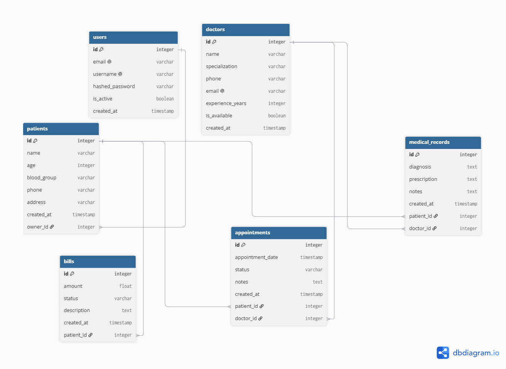
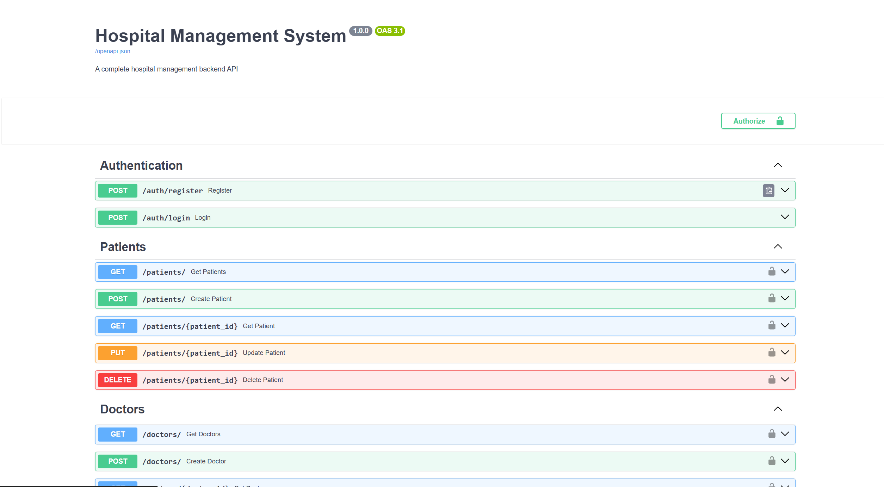

# 🏥 Hospital Management System

A complete hospital management backend API built with FastAPI and PostgreSQL.

---

## 🚀 What This Project Does

- Register and login securely
- Manage patients with medical history
- Manage doctors with specializations
- Book and track appointments
- Maintain medical records and prescriptions
- Generate and track patient bills

---

## 🧠 What I Learned Building This

- Complex multi-domain relationships
- Medical record management
- Appointment scheduling system
- Billing and payment tracking
- Multi-table queries across patients, doctors and appointments

---

## 🛠️ Tech Stack

| Technology | Purpose |
|------------|---------|
| Python 3.14 | Programming language |
| FastAPI | Web framework |
| PostgreSQL | Database |
| SQLAlchemy | ORM |
| Alembic | Migrations |
| PyJWT | Authentication |
| bcrypt | Password hashing |
| Docker | Containerization |
| Uvicorn | Server |

---

## ⚙️ How To Run

### Without Docker:
```bash
git clone https://github.com/sivamani151dev-cell/hospital-management.git
cd hospital-management
python -m venv venv
venv\Scripts\activate
pip install -r requirements.txt
python -m alembic upgrade head
uvicorn app.main:app --reload
```

### With Docker:
```bash
docker-compose up --build
```

---

## 📡 API Endpoints

### Authentication
| Method | Endpoint | Description | Auth |
|--------|----------|-------------|------|
| POST | `/auth/register` | Register | ❌ |
| POST | `/auth/login` | Login | ❌ |

### Patients
| Method | Endpoint | Description | Auth |
|--------|----------|-------------|------|
| POST | `/patients/` | Add patient | ✅ |
| GET | `/patients/` | Get all patients | ✅ |
| GET | `/patients/{id}` | Get patient | ✅ |
| PUT | `/patients/{id}` | Update patient | ✅ |
| DELETE | `/patients/{id}` | Delete patient | ✅ |

### Doctors
| Method | Endpoint | Description | Auth |
|--------|----------|-------------|------|
| POST | `/doctors/` | Add doctor | ✅ |
| GET | `/doctors/` | Get all doctors | ✅ |
| GET | `/doctors/{id}` | Get doctor | ✅ |
| PUT | `/doctors/{id}` | Update doctor | ✅ |
| DELETE | `/doctors/{id}` | Delete doctor | ✅ |

### Appointments
| Method | Endpoint | Description | Auth |
|--------|----------|-------------|------|
| POST | `/appointments/` | Book appointment | ✅ |
| GET | `/appointments/` | Get all | ✅ |
| GET | `/appointments/{id}` | Get specific | ✅ |
| PUT | `/appointments/{id}` | Update status | ✅ |
| DELETE | `/appointments/{id}` | Cancel | ✅ |

### Medical Records
| Method | Endpoint | Description | Auth |
|--------|----------|-------------|------|
| POST | `/medical-records/` | Add record | ✅ |
| GET | `/medical-records/patient/{id}` | Patient records | ✅ |

### Bills
| Method | Endpoint | Description | Auth |
|--------|----------|-------------|------|
| POST | `/bills/` | Create bill | ✅ |
| GET | `/bills/patient/{id}` | Patient bills | ✅ |
| PUT | `/bills/{id}` | Update status | ✅ |

---

## 📊 Database Schema



---

## 📸 Screenshots



---

## 🎯 Project Type
Client-Ready Project — built to demonstrate enterprise-level hospital management capabilities.